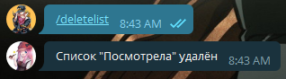
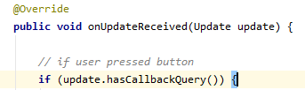

## AnimeBot   
#### @an_i_me_bot
Telegram-бот с PostgreSQL базой данных аниме

Работа заключалась в создании телеграм-бота, который в своей основе 
использует базу данных аниме (на данный момент бот выключен).   
  
    
  ***1)	Класс MyDatabase*** отвечает за манипуляции с базой данных. В этом классе мы создаём базу данных, если она ещё не создана, а после этого подключаемся к ней. При каждом подключении к базе данных используются приватные данные владельца базы данных, в файле «PrivateData» необходимо прописать имя базы данных, имя пользователя и пароль. За создание и подключение к базе данных отвечает метод createDatabaseIfNotExistsAndConnect. 
Если база данных только создаётся, то после её создания вызывается метод создания её таблиц, после чего начинается процесс заполнения этой базы данных.   
  В качестве основного источника информации для базы данных я решил использовать следующий сайт: https://yummyanime.club.  
    Для получения этой информации с сайта мною был написан класс HTMLParser, он используется в методе fillTablesFromWeb. Этот метод позволяет на усмотрение владельца базы данных либо записывать в базу данных топ-100 аниме с сайта, либо ссылки отдельных аниме, которые владелец хочет добавить. Помимо методов, которые нужны для записи данных, в этом классе используются методы получения данных из базы данных. Так, например, метод getAnimeByListNameAndUserId используется для получения названий всех аниме, которые пользователь добавил в один из своих списков. Полученные данные хранятся в классе ResultSet, который предоставляется java.sql. 

  ***2)	Класс HTMLParser*** был написан на основе библиотеки Jsoup, которая помогает получать информацию с web-страниц. 

 ***3)	Класс ReadTxtFile*** используется для считывания ссылок, по которым будет производиться заполнение базы данных. Этот класс используется в методе createDatabaseIfNotExistsAndConnect класса MyDatabase сразу после создания пустых таблиц базы данных.

  ***4)	Класс Anime*** – это абстракция таблицы “Anime”. Содержит такие же поля, что и в базе данных, то есть название, студии, жанры, год выпуска и т.д.

  ***5)	 Класс User*** содержит только один метод – addUserIfNeed. Из названия метода ясно, что он нужен для добавления пользователя в базу данных. Это добавление произойдёт в классе AnimeBot в методе onUpdateReceived при первом запуске бота. Будет записано имя пользователя и его id.

  ***6)	Класс Commands*** реализует команды, которые пользователь может выполнять. Возможные команды:

  
  
* Start (метод start) – первая команда, которую запускает пользователь. Пользователю показывается сообщение о том, что может делать бот, какие у него есть команды. Также пользователь добавляется в базу данных (пункт 5).

 

Метод setCommandButton позволяет добавить кнопку с нужной командой на клавиатурную панель. В данном случае используется класс KeyBoardButton, это один из видов кнопок, которые предоставляет Telegram. Следующая кнопка, например, добавляется в методе start:
 

После нажатия на кнопку выполнится соответствующая команда.

* Help (метод help) – команда, которая напоминает пользователю возможные команды

Метод showBasicCommands делает то же, что и метод setCommandButton, но добавляет несколько кнопок. Следующие кнопки добавляются в методе help:
 

* Genre (showGenres) – пользователю выводятся кнопки, на которых написаны жанры, пользователь выбирает одну, кнопки удаляются, после этого пользователю присылается сообщение со случайным аниме этого жанра.  
 

Для создания этого вида кнопок используется класс InlineKeyboardButton.

* CreateList – позволяет создать список с аниме  
 
  

* Lists (listCommands) – показывает списки, которые пользователь создал
 

При этом также вызывается метод showListCommands, который добавляет следующие кнопки:
 

* DeleteList – удаляет выбранный список пользователя
 

После выбора списка 2 последних сообщения удалятся:
 
 

 * Random – пользователю присылается изображение из аниме, название, жанры, год выпуска и прочее. Также после будет выслано ещё одно сообщение, которое позволит пользователю поставить оценку этому аниме или добавить его в свой список:
 

***7)	Класс CallBack*** используется для того, чтобы обработать нажатия кнопок класса InlineKeyboardButton. Так, например, при выборе определённого жанра (вызов команды /genre) в методе showGenres класса Commands каждой кнопке мы задаём callback, для этого используется специальный метод класса InlineKeyboardButton – setCallbackData:

 

После выбора определённой кнопки данные будут обработаны в классе AnimeBot в методе onUpdateReceived, подробнее об этом в пункте 8. 
Аналогичным образом происходит обработка остальных кнопок. 

***8)	Класс AnimeBot*** основан на классе TelegramLongPollingBot, который позволяет работать с Telegram. При наследовании от этого класса необходимо переопределить 3 метода: getBotUsername, getBotToken, onUpdateReceived. В первом методе нужно вернуть название бота, во втором необходимо вернуть специальный токен, который Telegram выдаёт после регистрации бота, а в третьем нужно прописать код, который будет выполняться при различных действиях пользователя. Из этих 3-х методов внимание стоит уделить только последнему, так как первые 2 в буквальном смысле занимают только строчку. 
3-ий метод делится на 2 части. 

* Первая половина этого метода – это обработка callback-ов, к этому относится всё, что входит в первый «if» метода:
 

В качестве примера обработки данных снова вернёмся к примеру с жанрами (пункт 7). Там после нажатия на кнопку с жанром отправлялся callback:
 
 

Здесь же мы его принимаем:

 
А обработка полученных данных происходит в CallBack:

 
Аналогичным образом происходит обработка других данных.

* Вторая половина метода необходима для обработки команд, поступающих от пользователя.

Также помимо основных 3-х методов есть 2 других метода:
Метод sendMsg, который позволяет отправлять сообщение с определённым текстом определённому пользователю, а также метод deleteMessage, с помощью которого сообщения можно удалять.

***9)	Класс SendAnime*** работает с уже полностью готовым набором данных, поэтому в нём выполняется отправка пользователю аниме по жанру, случайного аниме, а также отправляется изображение аниме.

   
   
------------------------------------------------------------------------------------   
# Схема базы данных

